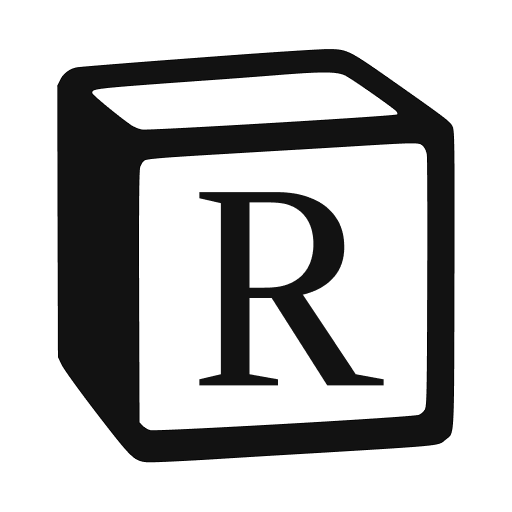

<!DOCTYPE html>
<html lang="pt-BR">

<head>
  <meta charset="UTF-8">
  <meta name="viewport" content="width=device-width, initial-scale=1.0">
  <title>README</title>
</head>

<body>

  <h1 align="center">
    
  </h1>

  <h3 align="center">Desenvolvido em: </h3>

  <div align="center">
    
    
         
  </div>

  <br>

  <p align="center">
    <a href="#como-usar">✅ Como Usar?</a>&nbsp;&nbsp;&nbsp;|&nbsp;&nbsp;&nbsp;
    <a href="#tecnologias">🚀 Tecnologias</a>&nbsp;&nbsp;&nbsp;|&nbsp;&nbsp;&nbsp;
    <a href="#autores">💻 Autores</a>&nbsp;&nbsp;&nbsp;|&nbsp;&nbsp;&nbsp;
    <a href="#licença">📝 Licença</a>
  </p>

  <p align="center">
    O <b>Rotion</b> é um aplicação desktop criado com <b>Electron</b>, <b>React</b> e <b>TypeScript</b>, como exercício do curso <b>"Aplicações Desktop com Electron"</b> desenvolvido pela <b>Rocketseat</b>.🚀
  </p>

  <hr />

  <h2 id="como-usar">✅ Como Usar?</h2>

  <p>Para rodar o projeto localmente, siga os passos abaixo:</p>


  
  ## 1 - Clone este repositório:
  ```bash
  git clone https://github.com/HumbertoGaldino/rotion
  ```

  ## 2 - Instale as dependências:

  ```bash
  npm install
  ```

  ## 3 - Execute a aplicação:
  
  ```bash
  npm run dev
  ```


  <hr />

  <h2 id="tecnologias">🚀 Tecnologias</h2>

  <ul>
    <li><a href="https://www.electronjs.org/pt/">Electron</a></li>
    <li><a href="https://pt-br.reactjs.org/">React</a></li>
    <li><a href="https://www.typescriptlang.org/">TypeScript</a></li>
    <li><a href="https://tanstack.com/query/v3/">React Query</a></li>
    <li><a href="https://tiptap.dev/">TipTap</a></li>
    <li><a href="https://github.com/lukeed/clsx">clsx</a></li>
    <li><a href="https://github.com/pacocoursey/cmdk">cmdk</a></li>
    <li><a href="https://github.com/daltonmenezes/electron-router-dom">Electron Router Dom</a></li>
    <li><a href="https://github.com/sindresorhus/electron-store">Electron Store</a></li>
    <li><a href="https://github.com/phosphor-icons/react">Phosphor React</a></li>
    <li><a href="https://tailwindcss.com/">TailwindCSS</a></li>
    <li><a href="https://vitejs.dev/">Vite</a></li>
  </ul>

  <hr />

  


 <h3>👨‍💻 Desenlvolvido por:</h3>
 
  [](https://github.com/HumbertoGaldino)
  [](https://www.rocketseat.com.br/)

  <h2 id="licença">📝 Licença</h2>

  <p>Este projeto é licenciado sob os termos da licença MIT. Consulte a página <a href="./LICENSE">LICENSE</a> para mais detalhes.</p>

</body>

</html>
